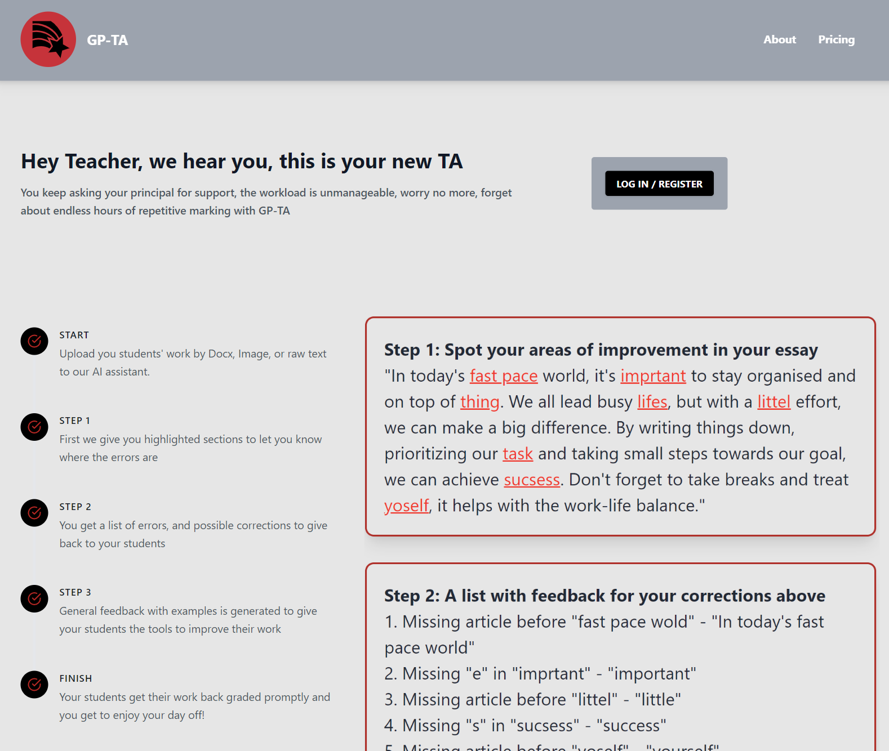
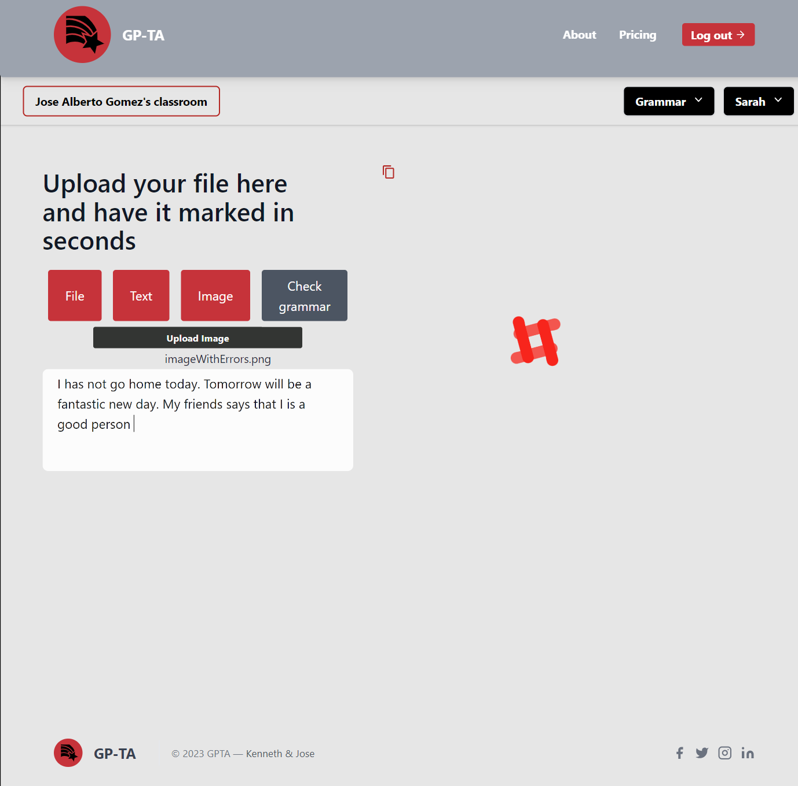
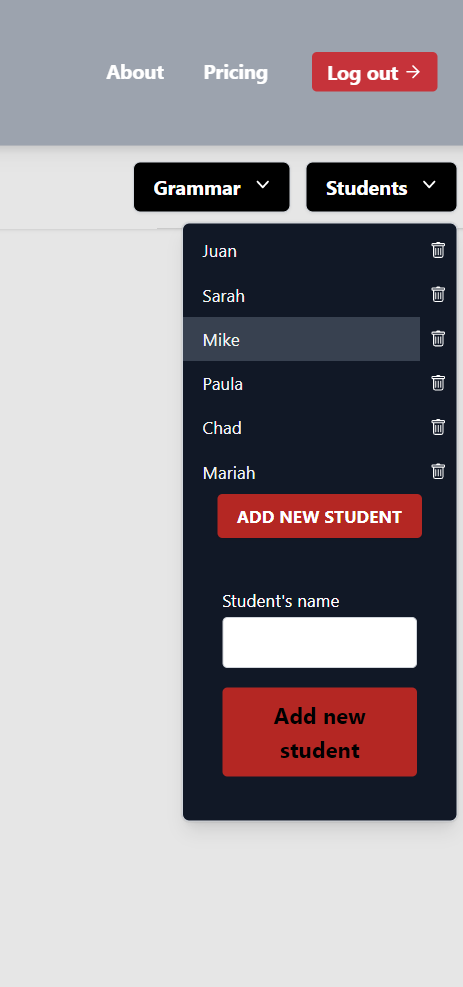
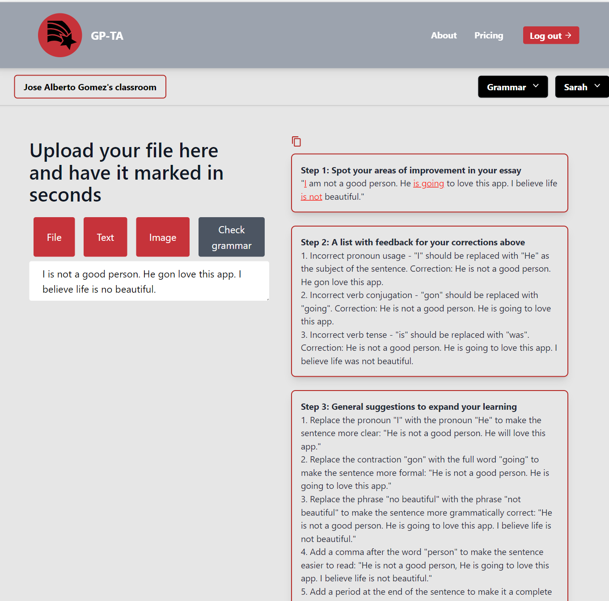

# GP-TA


<p align="center">
  
</p>

GP-TA is an AI Teaching Assistant to mark grades automatically. It aims at reducing foreing language teachers workload while still providing helpful and accurate feedback.


1. It allows users to create and log onto their profile. 
2. Users can access a classroom dashboard where they can create folders for students and assing multiple assignments to each student. 
3. Student's essays may be uploaded on a doc file, an image file or simply copy and paste. Then, let the AI do its magic and return feedback.
4. Feedback is returned in three different steps:
      - Step 1: It returns the text submitted by the student highlighting grammar and spelling mistakes.
      - Step 2: It provides a list with each mistake and specific feedback about it.
      - Step 3: It suggests several areas of improvement to expand student's progress based on the text. 
 5. It includes Stripe payments 


## Screenshots

<p align="center">
  
  
  
  
  

</p>


## Getting started

1. Clone the repo

```
https://github.com/Kennyk22/GP-TA.git
cd GP-TA
```

2. Install dependencies
```
npm install
```
4. Start client at client folder

```
npm start

```
6. Start development server at server folder
```
npm run dev

```
## Tech Stack

* [React](https://reactjs.org/)
* [NodeJS](https://nodejs.org/en/)
* [Koa](https://koajs.com/)
* [Postgres](https://www.postgresql.org/)
* [Sequelize](https://sequelize.org/)

* [AuthO](https://auth0.com/)
* [OpenAI](https://openai.com/api/)

* [TailWinds UI library](https://tailwindcss.com/)
* [Stripe API](https://stripe.com/)
* [Tesseract JS](https://tesseract.projectnaptha.com/)

* [Jest](https://jestjs.io/)


## Author
Jose Alberto Gomez - [Github](https://github.com/Josequesada9393) - [LinkedIn](https://www.linkedin.com/in/jose-alberto-gomez/)
Kennth Karter - [Github] (https://github.com/Kennyk22) - [LinkedIn](https://www.linkedin.com/in/kenneth-karter-253a89265/)
